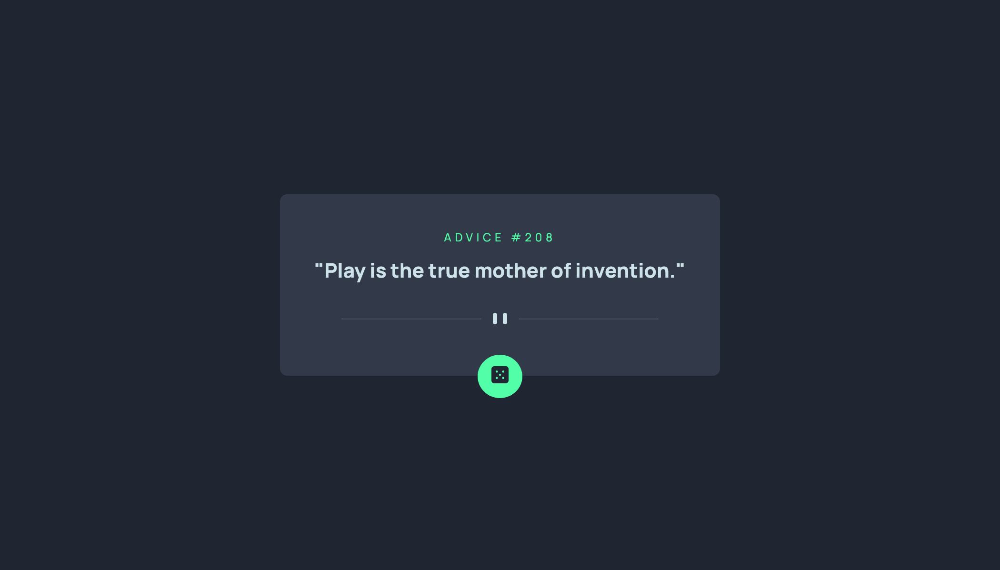
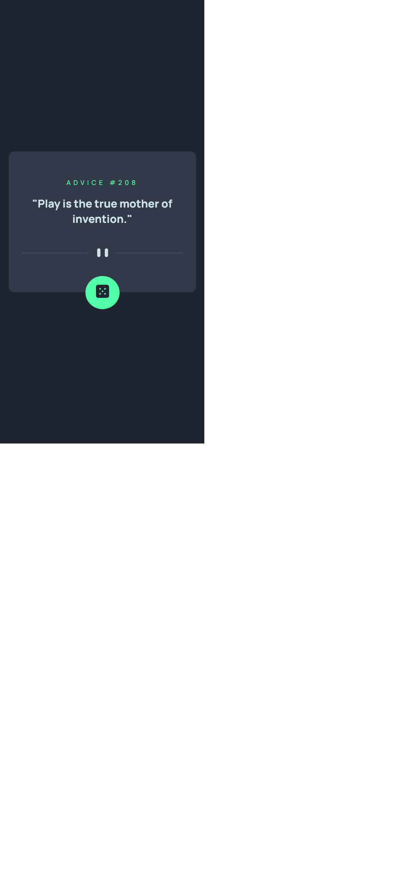

# Frontend Mentor - Advice generator app solution

This is a solution to the [Advice generator app challenge on Frontend Mentor](https://www.frontendmentor.io/challenges/advice-generator-app-QdUG-13db). Frontend Mentor challenges help you improve your coding skills by building realistic projects.

## Table of contents

-   [Overview](#overview)
    -   [The challenge](#the-challenge)
    -   [Screenshot](#screenshot)
    -   [Links](#links)
-   [My process](#my-process)
    -   [Built with](#built-with)
    -   [What I learned](#what-i-learned)
    -   [Continued development](#continued-development)
    -   [Useful resources](#useful-resources)
-   [Author](#author)
-   [Acknowledgments](#acknowledgments)

**Note: Delete this note and update the table of contents based on what sections you keep.**

## Overview

### The challenge

Users should be able to:

-   View the optimal layout for the app depending on their device's screen size
-   See hover states for all interactive elements on the page
-   Generate a new piece of advice by clicking the dice icon

### Screenshot




### Links

-   Solution URL: (https://your-solution-url.com)
-   Live Site URL: [Add live site URL here](https://your-live-site-url.com)

## My process

### Built with

-   Semantic HTML5 markup
-   CSS custom properties
-   Flexbox
-   Javascript
-   Responsive
-   Advice Slip JSON API

### What I learned

I learned to use fetch API in this challenge. Although I'm not very sure if I did it right when displaying it on the html.

```js
let toggle = document.querySelector("#toggle");
let adviceText = document.querySelector(".advice");
let adviceId = document.querySelector("#advice-id");

function getAdvice() {
    fetch("https://api.adviceslip.com/advice")
        .then((response) => {
            // console.log("resolved", response);
            return response.json();
        })
        .then((data) => {
            const advice = data.slip.advice;
            const id = data.slip.id;
            adviceText.innerHTML = `"${advice}"`;
            adviceId.innerHTML = id;
        });
}
getAdvice();
toggle.addEventListener("click", getAdvice);
```

### Useful resources

-   (https://youtu.be/drK6mdA9d_M) - I used this youtube video by The Net Ninja about how to use the fetch api.
-   (https://youtu.be/AeYPcVSS_Nc) - And this one I used as a reference on how to display the data that I get to the DOM.

## Author

-   Frontend Mentor - [@Ao-chi](https://www.frontendmentor.io/profile/Ao-chi)
-   Linkedin - [@Josh](robert-joshua-zulueta)
